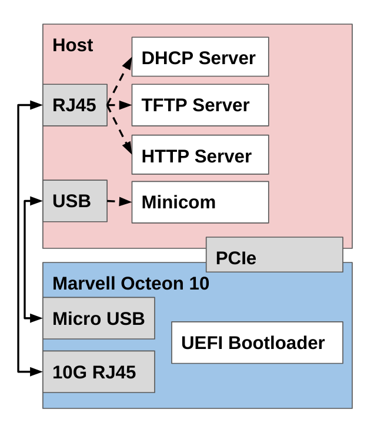

# Installing RHEL on Marvell Octeon 10

Welcome to this guide on installing Red Hat Enterprise Linux (RHEL) on the Marvell Octeon 10 DPU. This article will guide you through the process of setting up RHEL on the Marvell Octeon 10 using the 10G management interface and a PXE server on the host machine.

IMPORTANT: Please note that it is assumed that the UEFI Bootloader is flashed correctly onto the secondary SPI memory device. If not, please contact your Marvell FAE to be given the instructions to do so. You only need to flash the UEFI Bootloader once unless there are bug fixes or improvements provided by Marvell.

# Overview of the Setup

When it comes to installing RHEL on the Marvell Octeon 10, a PXE server can be set up either on the network or on the host machine itself. The advantage of choosing the latter is that the management network is looped back to the host itself. Also the host will have access to the serial terminal via USB. This self-contained approach simplifies the provisioning process, making it more accessible and user-friendly. The diagram below shows the setup:



Components of the setup:

- UEFI Bootloader flashed on the Marvell Octeon 10
- RHEL installation on x86 host with minicom
- RHEL iso (downloaded through your Red Hat subscription)
- Custom GRUB configuration
- Custom kickstart configuration
- TFTP server
- DHCP server
- HTTP server

# Setting up DHCP

The DHCP server for the purposes of this document of installing RHEL will be used to give the UEFI bootloader an IP address when attempting to PXE boot the ISO image through TFTP. However this DHCP server can be used by U-Boot to burn the UEFI bootloader onto the secondary SPI memory device on the Marvell Octeon 10.

Start by installing the DHCP server for RHEL on the host:

```bash
dnf install -y dhcp-server
```

For the interface directly connected to the 10G management port on the Marvell Octeon 10, assign the ip address "172.131.100.1/24" to it

```bash
# E.g. $IF_NAME = eno4
ip addr add 172.131.100.1/24 dev $IF_NAME
```

Create/change the dhcpd config at `/etc/dhcp/dhcpd.conf` to the following. Please replace the DNS servers and domain with your own.:

```bash
option space pxelinux;
option pxelinux.magic code 208 = string;
option pxelinux.configfile code 209 = text;
option pxelinux.pathprefix code 210 = text;
option pxelinux.reboottime code 211 = unsigned integer 32;
option architecture-type code 93 = unsigned integer 16;

allow booting;
allow bootp;

next-server 172.131.100.1;
always-broadcast on;

subnet 172.131.100.0 netmask 255.255.255.0 {
    range 172.131.100.10 172.131.100.20;
    option broadcast-address 172.131.100.255;
    option routers 172.131.100.1;
    option domain-name-servers <INSERT COMMA SEPARATED LIST OF DNS SERVERS HERE>;
    option domain-search "<INSERT DOMAIN HERE>";
    option dhcp-client-identifier = option dhcp-client-identifier;
    class "pxeclients" {
        match if substring (option vendor-class-identifier, 0, 9) = "PXEClient";
        filename "/grubaa64.efi";
    }
}
```

Restart DHCPD with the following command:

```bash
systemctl restart dhcpd
```

After restarting, make sure that DHCPD is running properly:

```bash
systemctl status dhcpd
```

# Setting up TFTP

The DHCP server for the purposes of this document of installing RHEL will be used to provide the Linux Kernel, Init RAM Disk, GRUB EFI, and the custom GRUB config to the UEFI Bootloader.

Start by installing the TFTP server for RHEL on the host:

```bash
dnf -y install tftp tftp-server
systemctl enable tftp.service --now
firewall-cmd --permanent --add-service=tftp
firewall-cmd --reload
mkdir -p /etc/systemd/system/tftp.service.d
```

Unfortunately the TFTP client in the UEFI bootloader does not support options properly thus we need to modify the TFTP server on the host with the `-B` option in the file `/usr/lib/systemd/system/tftp.service`:

Change the `ExecStart` line from:

```bash
ExecStart=/usr/sbin/in.tftpd -s /var/lib/tftpboot
```

To:

```bash
ExecStart=/usr/sbin/in.tftpd -B 1468 -s /var/lib/tftpboot
```

Then restart the TFTP server service file:

```bash
systemctl daemon-reload
systemctl restart tftp
```

After restarting, make sure that TFTP is running properly:

```bash
systemctl status tftp
```

# Setting up the mandatory PXE files

Please make sure that the DHCP and TFTP servers are running correctly. Following the steps above.

Firstly, download the RHEL iso from your RH subscription. Note that you need the AARCH version of the RHEL iso since the Marvell Octeon 10 uses the ARM architecture. Mount the iso:

```bash
# E.g. $ISO_PATH = ~/RHEL-9.2.0-aarch64-dvd1.iso
#      $MNT_ISO_PATH = /mnt/rhel
mount -t iso9660 -o loop $ISO_PATH $MNT_ISO_PATH
```

Create a TFTP boot directory and copy the necessary files:

```bash
mkdir /var/lib/tftpboot/
mkdir /var/lib/tftpboot/pxelinux
cp $MNT_ISO_PATH/images/pxeboot/vmlinuz /var/lib/tftpboot/pxelinux
cp $MNT_ISO_PATH/images/pxeboot/initrd.img /var/lib/tftpboot/pxelinux
cp $MNT_ISO_PATH/EFI/BOOT/grubaa64.efi /var/lib/tftpboot/
chmod 744 /var/lib/tftpboot/grubaa64.efi
```

Create a custom GRUB configuration at `/var/lib/tftpboot/grub.cfg` where 172.131.100.1 is the IP of the host interface connected to the 10G management port of the Octeon 10 DPU. Firstly the Grub EFI (`grubaa64.efi`) is loaded via the PXE options from DHCP. Then the GRUB config is read and the Linux Kernel (`vmlinuz`) and Init RAM Disk (`initrd.img`) is loaded from TFTP.

```bash
set timeout=10

menuentry 'Install' {
    linux pxelinux/vmlinuz ip=dhcp inst.repo=http://172.131.100.1/rhel_iso/ inst.ks=http://172.131.100.1/kickstart.ks
    initrd pxelinux/initrd.img
}
```

This GRUB configuration references where the repo and kickstart files would be found via an HTTP webserver. The `vmlinuz` and `initrd.img` are made available already from the TFTP boot directory (`/var/lib/tftpboot/pxelinux`).

We will be using Python's HTTP server for convenient start and stop of the webserver. Please make sure python is installed:

```bash
dnf -y install python
```

Now let's prepare the files for HTTP. We will create a `/www` webserver directory and statically link the mounted ISO to the webserver directory. The mounted ISO being statically linked to the webserver will provide the RHEL installer with additional packages.

```bash
mkdir /www
ln -s $MNT_ISO_PATH /www
```

Create a new kickstart file under `/www/kickstart.ks`:

```bash
# Root Password
rootpw myrootpassword

# System language
lang en_US.UTF-8

# System timezone
timezone America/New_York --utc

# Use text mode install
text

# Accept the license
eula --agreed

# Disable firewall
firewall --disabled

# Do not configure the X Window System
skipx

# Disable the Setup Agent on first boot
firstboot --disabled

# Network information
network --bootproto=dhcp --hostname=marvell-soc.redhat --device=enP2p6s0 --activate

ignoredisk --only-use=nvme0n1
# System bootloader configuration
bootloader --append="crashkernel=1G-4G:256M,4G-64G:320M,64G-:576M" --location=mbr --boot-drive=nvme0n1
autopart
# Partition clearing information
clearpart --all --initlabel --drives=nvme0n1

# Reboot after installation
reboot

%packages --ignoremissing
@base
@core
@Development Tools
python3-devel
atk
cairo
tcl
tk
nfs-utils
chrony
vim
ethtool
git
grubby
xterm
NetworkManager-config-server
%end
```

Please note that the interface `enP2p6s0` should be the 10G Management Port. Please change `myrootpassword` with your own desired root password. Also this will install on the NVME drive. This MUST be populated prior to the card being seated into the server.

(Optional) A useful tool called `ksvalidator` can be used to validate the `kickstart.ks` file:

```bash
dnf install pykickstart
ksvalidator /www/kickstart.ks
```

Now we can start the HTTP server

```bash
cd /www
python -m http.server 80
```

# Installing via UEFI PXE Boot on the 10G Management Port

The steps above should have prepared the necessary files and servers running to PXE boot. Please make sure all the steps above are preformed and the DHCP, TFTP, and HTTP servers are running.

Firstly you should install minicom:

```bash
dnf install -y minicom
```

Find which USB devices from the Marvell Octeon 10 are connected to the HOST

```bash
dmesg | grep ttyU
[1033246.599230] usb 1-13: cp210x converter now attached to ttyUSB0
[1033246.617773] usb 1-13: cp210x converter now attached to ttyUSB1
```

From this output, `ttyUSB0` and `ttyUSB1` are associated with the Marvell Octeon 10. The `ttyUSB1` device is used to reset the Marvell Octeon 10 in the case of failure. The `ttyUSB0` device is the serial terminal to the Marvell Octeon 10. This will be the device we will use to launch PXE Boot from UEFI.

```bash
minicom -D /dev/ttyUSB0
```

IMPORTANT: The Marvell Octeon 10 has issues with the Hardware Flow Control. Make sure this option is set to `No` via
`O - cOnfigure Minicom` -> `Serial port setup` -> `F - Hardware Flow Control : No`. Also make sure the baud rate `E -    Bps/Par/Bits : 115200 8N1` is set correctly.

Reboot the Marvell Octeon 10 via `ttyUSB1` or typing reboot in the BuildRoot OS.

When you see `Press 'B' within 10 seconds for boot menu`, press the "B" key immediately.

Then choose `2) Boot from Secondary Boot Device`:

```bash
=================================
Boot Options
=================================
1) Boot from Primary Boot Device
2) Boot from Secondary Boot Device
N) Boot Normally
S) Enter Setup
D) Enter DRAM Diagnostics
K) Burn boot flash using Kermit
U) Change baud rate and flow control
R) Reboot

Choice: 2
```

When the UEFI Bootloader is running hit the `<ESC>` key when you see the following message:

```bash
Press ESCAPE for boot options ..
```

The following menu should now be visible:

```bash
 crb106-pcie
 A8                                                  2.50 GHz
 SDK12.23.10                                         40960 MB RAM


   Select Language            <Standard English>         This is the option
                                                         one adjusts to change
 > Device Manager                                        the language for the
 > Boot Manager                                          current system
 > Boot Maintenance Manager

   Continue
   Reset


  ^v=Move Highlight       <Enter>=Select Entry
```

Move to the `Boot Manager` and press `<ENTER>`. Then move through the menu until you hit and interface with the MAC address `80AA9988776A` and the UEFI PXEv4 option.

```bash
/------------------------------------------------------------------------------\
|                                Boot Manager                                  |
\------------------------------------------------------------------------------/
                                                       ^
   UEFI HTTPv6 (MAC:80AA99887767)                        Device Path :
   UEFI PXEv4 (MAC:80AA99887768)                         PciRoot(0x2)/Pci(0x5,0
   UEFI PXEv6 (MAC:80AA99887768)                         x0)/Pci(0x0,0x0)/MAC(8
   UEFI HTTPv4 (MAC:80AA99887768)                        0AA9988776A,0x1)/IPv4(
   UEFI HTTPv6 (MAC:80AA99887768)                        0.0.0.0,0x0,DHCP,0.0.0
   UEFI PXEv4 (MAC:80AA99887769)                         .0,0.0.0.0,0.0.0.0)
   UEFI PXEv6 (MAC:80AA99887769)
   UEFI HTTPv4 (MAC:80AA99887769)
   UEFI HTTPv6 (MAC:80AA99887769)
   UEFI PXEv4 (MAC:80AA9988776A)
   UEFI PXEv6 (MAC:80AA9988776A)
   UEFI HTTPv4 (MAC:80AA9988776A)
   UEFI HTTPv6 (MAC:80AA9988776A)
   UEFI Shell

                                                       v
/------------------------------------------------------------------------------\
|                                                                              |
| ^v=Move Highlight       <Enter>=Select Entry      Esc=Exit                   |
\------------------------------------------------------------------------------/
```

When this option is selected by pressing `<ENTER>`, the installation of RHEL should start.

# Conclusion

The Marvell Octeon 10 will reboot into the fresh RHEL environment after the installation completes.

# Appendix 1: Resetting the Marvell Octeon 10 DPU

Enter the other USB device for the Marvell Octeon 10 DPU

```bash
minicom -D /dev/ttyUSB1
```

IMPORTANT: The Marvell Octeon 10 has issues with the Hardware Flow Control. Make sure this option is set to `No` via
`O - cOnfigure Minicom` -> `Serial port setup` -> `F - Hardware Flow Control : No`. Also make sure the baud rate `E -    Bps/Par/Bits : 115200 8N1` is set correctly.

Enter the `M) Management commands`:

```bash
===================================
SCP Main Menu
===================================
P) Power Control commands
M) Management commands

Choice:  M
```

Enter the `r) Chip reset` to reset the Marvell Octeon 10 DPU.

```bash
===================================
SCP Management Menu
===================================
r) Chip reset
(blank line returns to Main Menu)

Choice:  r
```
